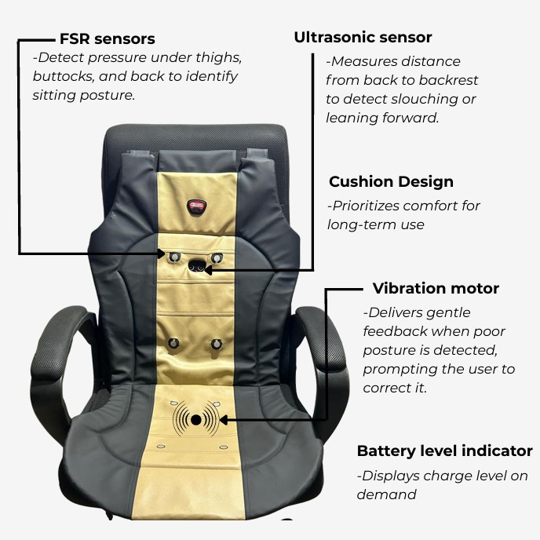
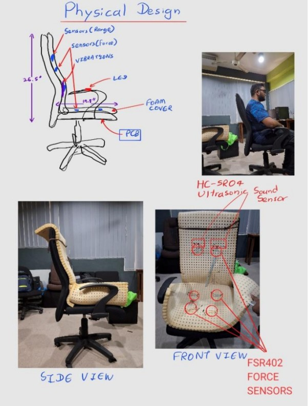
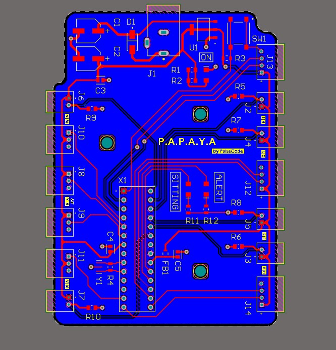
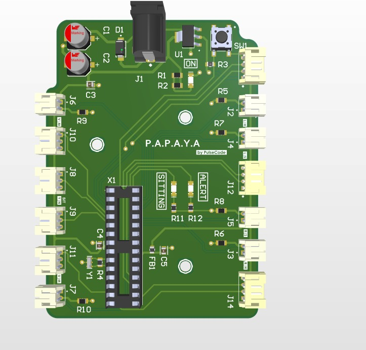
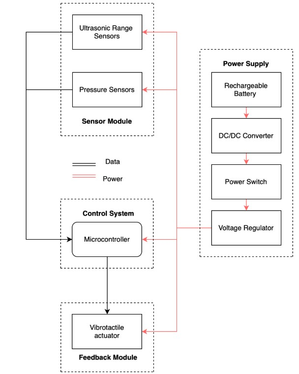
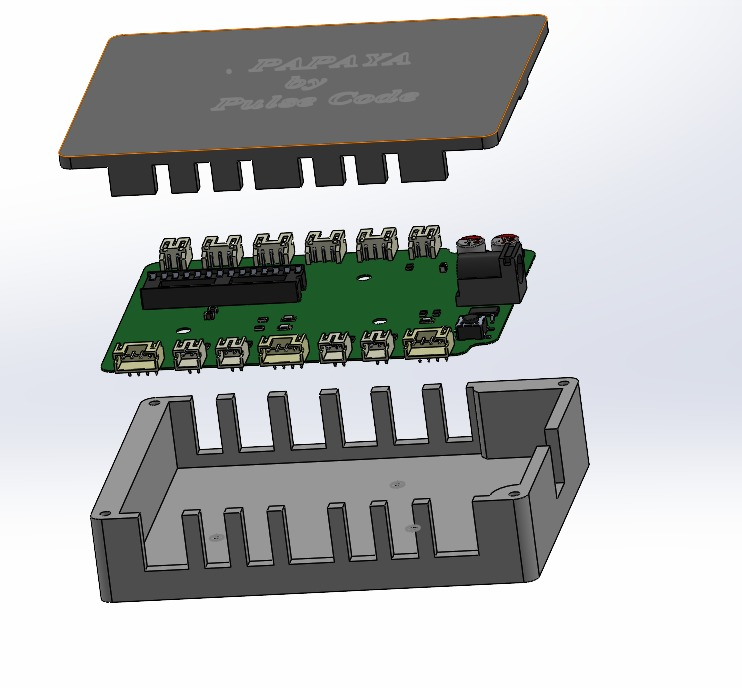

# 🪑 PulseCode – Smart Posture Cushion (P.A.P.A.Y.A.)

> **Posture Analysis and Proactive Alignment for Your Awareness**  
> A smart cushion that detects poor sitting posture in real-time and provides subtle haptic feedback to encourage healthy sitting habits.

📍 **2nd Runners Up – Brainstorm 2025**  
🏫 **University of Moratuwa – BM1190 Engineering Design Project**

---

## 📜 Project Overview
PulseCode is a human-centered ergonomic solution to combat posture-related back pain among desk-bound individuals.  
It combines **pressure sensors**, **distance sensing**, and **vibration feedback** to help users build healthy sitting habits without intrusive devices.

---

## 🛠 Features
- **8x FSR402 pressure sensors** for seat pressure mapping
- **Ultrasonic sensor (HC-SR04)** for back distance measurement
- **ATmega328P microcontroller** for posture logic
- **Vibration motor** for subtle posture alerts
- **Custom PCB** and **SolidWorks-designed enclosures**
- **LED battery level indicator**, USB-C charging, 7.4V Li-ion battery
- Automotive-grade foam cushion

---

## 📷 Images & Prototype
| Prototype | Inside View | PCB Layout |
|-----------|-------------|------------|
|  |  |   |

---

## 🖥 System Architecture

---

## 📐 Enclosure Designs

---

## 🔬 How It Works
1. **Posture Detection:**  
   - FSR sensors detect seating pressure patterns.  
   - Ultrasonic sensor measures back-to-backrest distance.  
2. **Processing:**  
   - ATmega328P processes sensor readings against preset thresholds.  
3. **Feedback:**  
   - Vibration motor alerts the user when posture deviates significantly.  
4. **User Control:**  
   - ON/OFF power switch + battery level check.

---

## 📑 Documentation
- [📄 Final Report](Final_Report_PAPAYA.pdf)  
- [📊 Final Presentation](Final_Presentation.pdf)  
- [🎯 Project Pitch Deck](PAPAYA_Project_Pitch.pdf)  

---

## 👨‍💻 Contributors
- Abdul Rahman  
- Mokshan Colombage  
- Buddhima Imbulpitiya  
- Chaleesha Keerawella

---

## 🏆 Achievements
- **2nd Runners Up – Brainstorm 2025**
- Fully functional MVP tested on real users
- Developed entirely in Semester 2 with in-house 3D printing and PCB fabrication
